# 스프링 부트 Actuator + Prometheus + Grafana Study Project

### 1. Actuator - Prometheus Endpoint
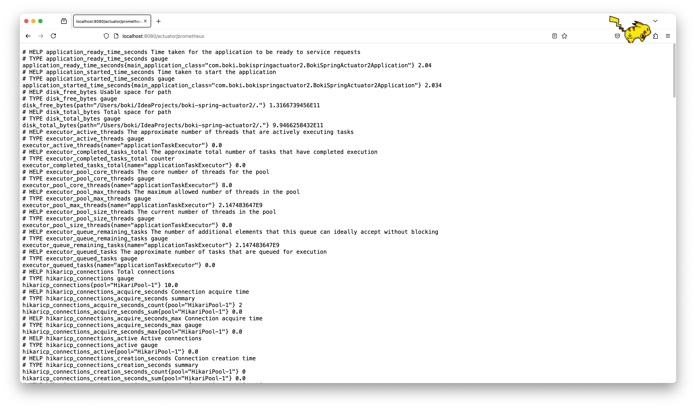

### 2. Target
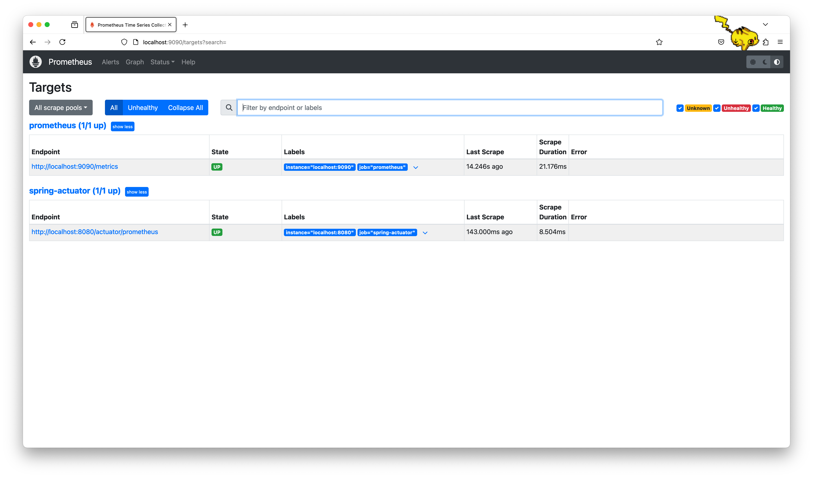

### 3. Prometheus Table
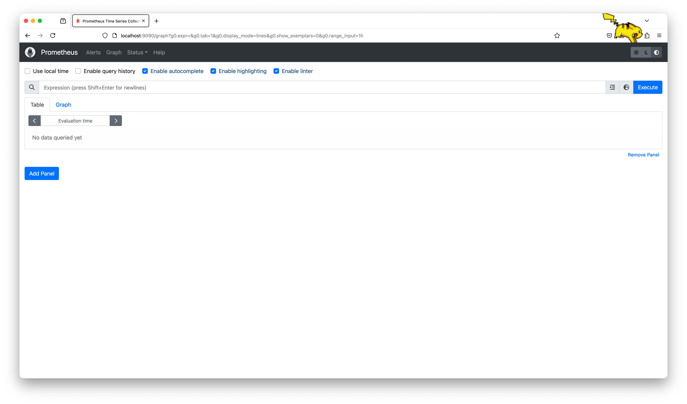

### 4. Prometheus Graph
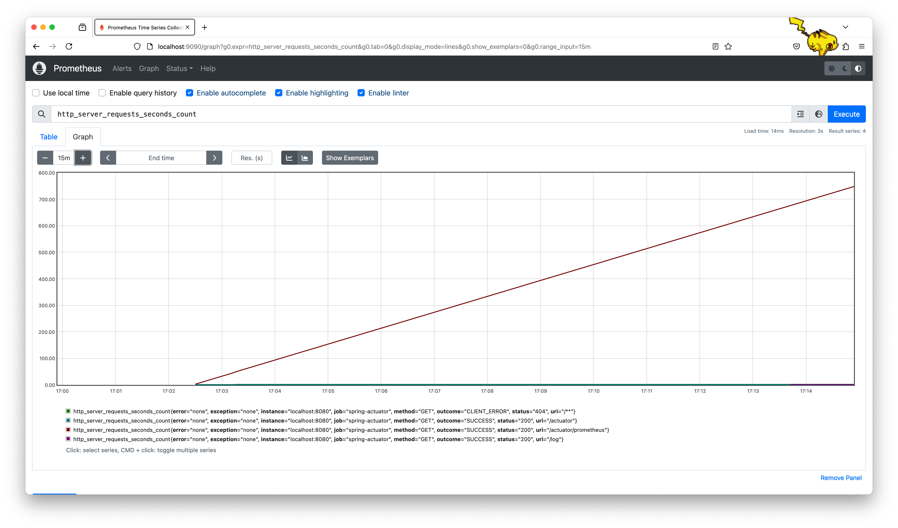

### 5. System Cpu Usage
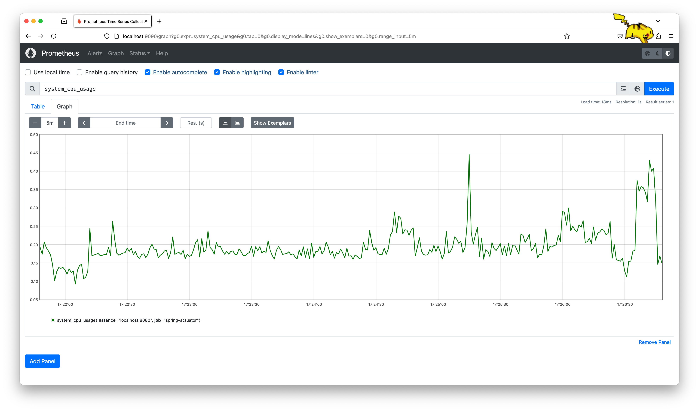

### 6. Increase
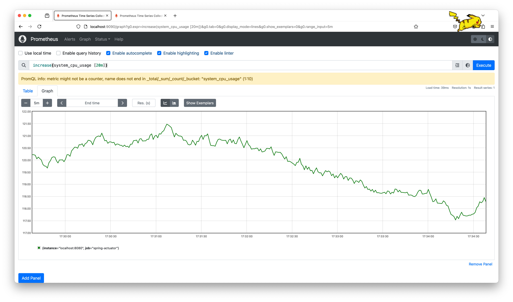

### 7. Rate
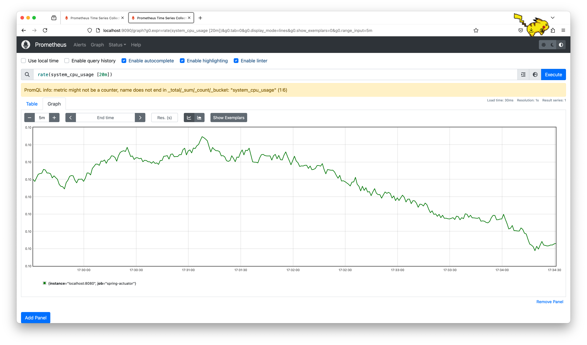

### 8. Prometheus With Grafana
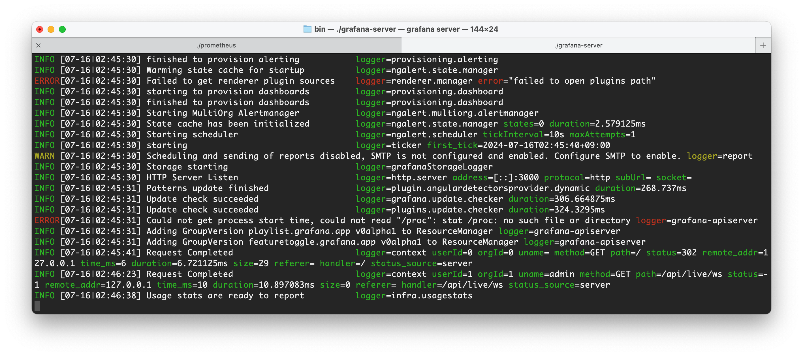

### 9. Grafana
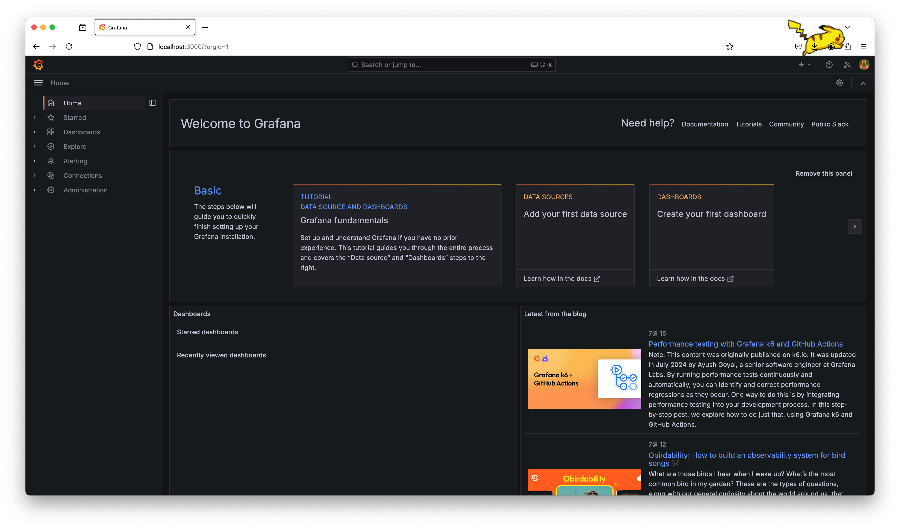

### 10.Connect
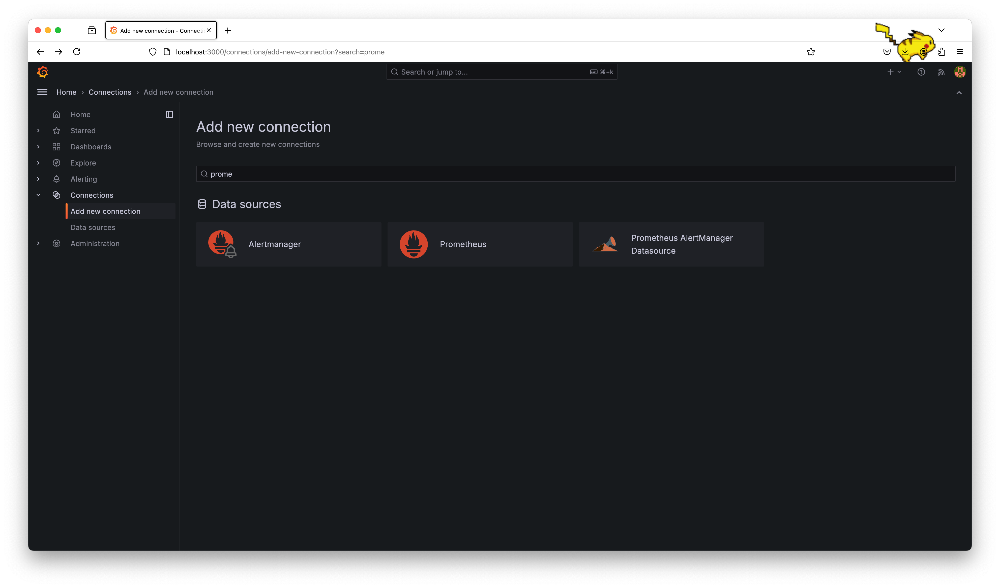

### 11. Dashboard Edit
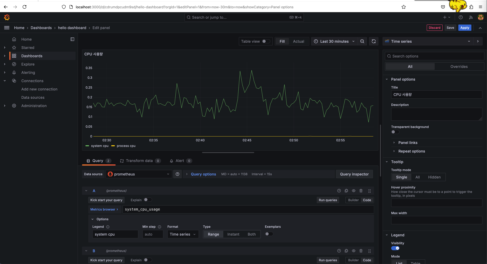

### 12. Custom Standard
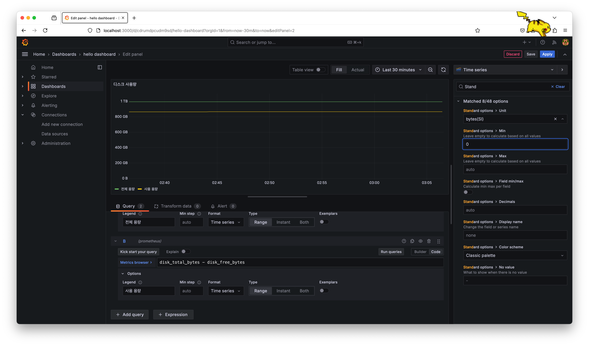

### 13. Custom Dashboard
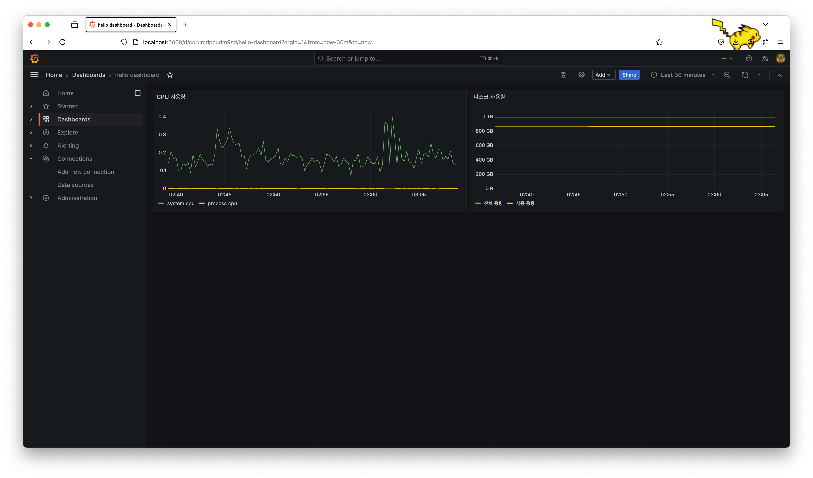

### 14. Spring boot 2.1 System Monitor Dashboard

### 15. Custom Spring boot 2.1 dashboard(tomcat)

### 16. JVM(micrometer)

### 17. Cpu Stress

### 18. Jvm Grafana

### 19. IDE Jvm Heap OOM

### 20. Jdbc(hikariCP)

### 21. IDE Connection Pool

### 22. Error Log

### 23. IDE Error Log

### 24. Custom Metric

### 25. Counted AOP

### 26. Order v3
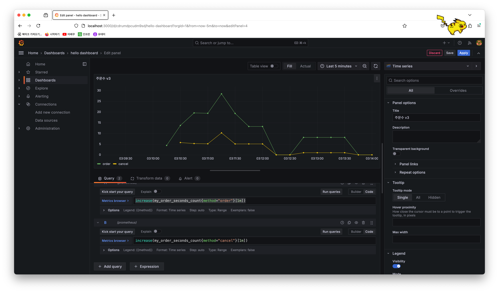

### 27. Timer Dashboard

### 28. Gauge
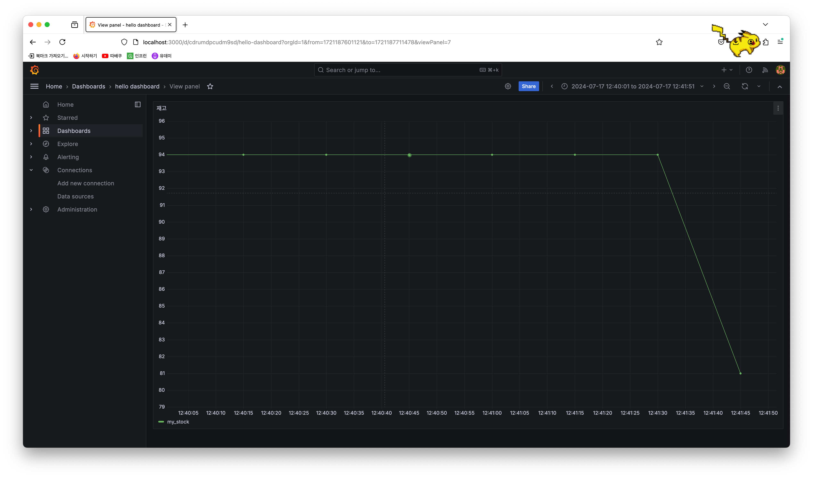
